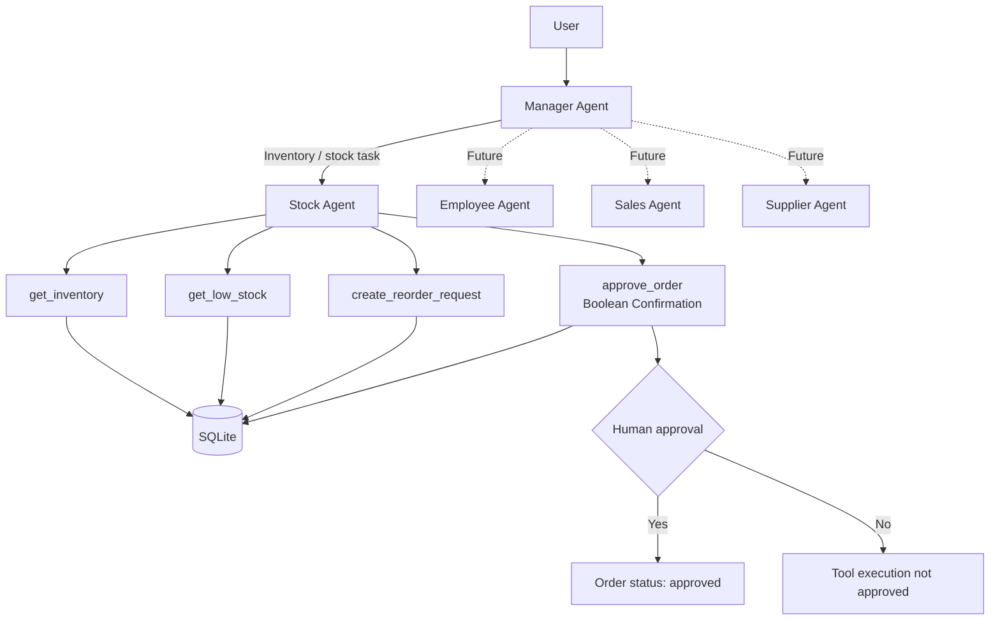
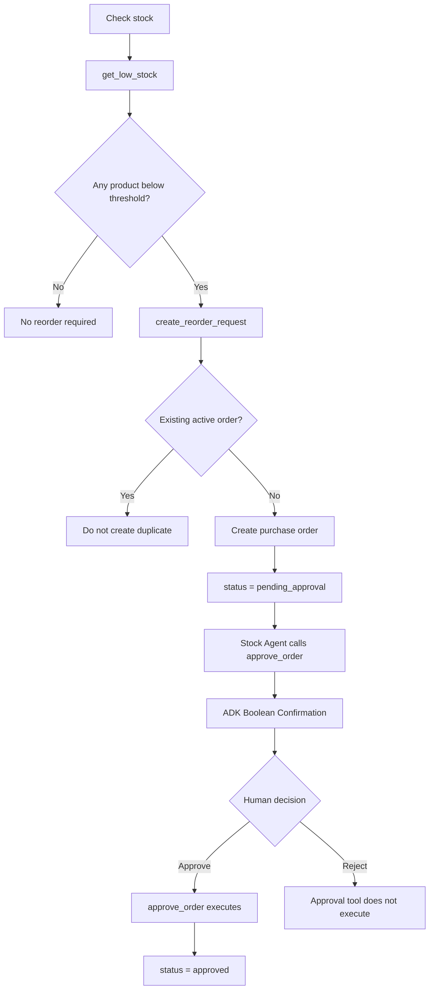
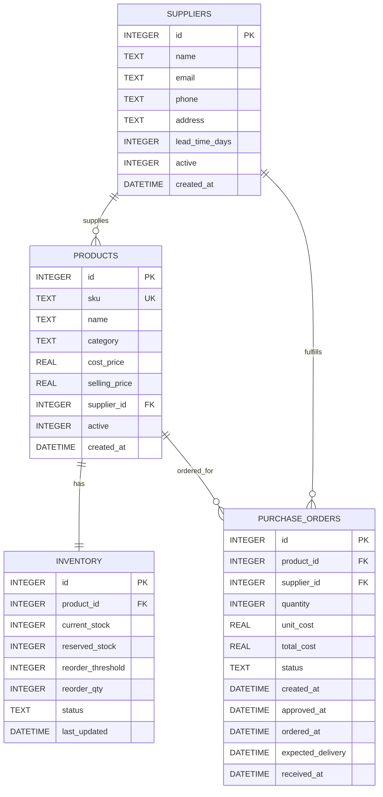

# StockPilot

StockPilot is a multi-agent AI inventory and operations management system built with **Google Agent Development Kit (ADK)**, **Gemini**, **Python**, and **SQLite**.

The system uses a **Manager Agent** to understand a user's request and delegate work to specialized sub-agents. The first implemented specialist is the **Stock Agent**, which can inspect inventory, detect low-stock products, prepare reorder requests, and request explicit human approval before approving a purchase order.

> **Human-in-the-loop by design:** StockPilot can autonomously detect a stock problem and prepare an action, but approval of a purchase order is protected by Google ADK Boolean Tool Confirmation.

---

## Features

- Multi-agent architecture with a central Manager Agent
- Specialized Stock Management Agent
- Local SQLite database
- Inventory and supplier data joined through SQL
- Automatic low-stock detection
- Purchase-order request generation
- Duplicate active-order protection
- Human-in-the-loop purchase-order approval
- Google ADK `FunctionTool` Boolean Confirmation
- Gemini-powered reasoning and delegation
- Extensible architecture for Employee, Sales, Supplier, and other agents

---

## Agent Architecture



The **Manager Agent** is responsible for routing tasks. It should not perform specialist stock operations itself when the Stock Agent can handle them.

The **Stock Agent** is responsible for inventory-related reasoning and uses deterministic Python tools to access and modify the database.

---

## Stock Reorder Workflow



The low-stock rule is:

```text
current_stock < reorder_threshold
```

For example:

```text
Current stock:      12
Reorder threshold:  20

12 < 20  →  product requires replenishment
```

---

## Human-in-the-Loop Approval

The Stock Agent registers `approve_order` as a Google ADK `FunctionTool` that requires confirmation:

```python
FunctionTool(
    approve_order,
    require_confirmation=True
)
```

This creates an execution boundary around the approval action.

The workflow is:

```text
Stock Agent
    ↓
create_reorder_request()
    ↓
Purchase order created
status = pending_approval
    ↓
Stock Agent requests approve_order()
    ↓
Google ADK pauses the tool
    ↓
Human receives Yes / No confirmation
    ↓
YES                         NO
 ↓                           ↓
approve_order() runs      Tool is not approved
 ↓
status = approved
```

The LLM itself does **not** provide the human approval signal.

---

## Current Stock Agent Tools

### `get_inventory()`

Retrieves all current inventory together with related product and supplier information.

It joins:

```text
inventory
    +
products
    +
suppliers
```

Typical returned data:

```json
{
  "product_id": 1,
  "sku": "SKU-1001",
  "name": "Blue Widget",
  "category": "Electronics",
  "cost_price": 2.5,
  "current_stock": 12,
  "reorder_threshold": 20,
  "reorder_qty": 100,
  "supplier_id": 1,
  "supplier_name": "Acme Supplies",
  "supplier_email": "orders@acme.test",
  "lead_time_days": 5
}
```

### `get_low_stock()`

Returns only products where:

```text
current_stock < reorder_threshold
```

This tool is useful for both user queries and autonomous reorder workflows.

### `create_reorder_request(product_id)`

Creates a purchase-order request for a low-stock product.

Before creating an order, the tool verifies that:

1. The product exists.
2. The product is actually below its reorder threshold.
3. There is no existing active purchase order for the same product.

An active order is one with one of these states:

```text
pending_approval
approved
ordered
```

If all checks pass, the tool creates a purchase order with:

```text
status = pending_approval
```

It also calculates:

```text
total_cost = reorder_qty × cost_price
```

### `approve_order(order_id)`

Approves an existing purchase order only when its current status is:

```text
pending_approval
```

The tool updates:

```text
status = approved
approved_at = CURRENT_TIMESTAMP
```

This tool is protected with ADK Boolean Confirmation:

```python
FunctionTool(
    approve_order,
    require_confirmation=True
)
```

---

## Database Architecture

StockPilot currently uses four main SQLite tables:



### `suppliers`

Stores supplier information such as contact details and lead time.

### `products`

Stores product metadata and connects every product to a supplier.

### `inventory`

Stores changing stock information such as current stock, reorder threshold, and reorder quantity.

### `purchase_orders`

Stores reorder requests and their approval/order lifecycle.

---

## Purchase Order Status Flow

Current and planned order states:

```text
pending_approval
       ↓
    approved
       ↓
     ordered
       ↓
    received
```

Alternative terminal states can include:

```text
rejected
cancelled
```

At the current stage, the implemented human-confirmed action changes the order from `pending_approval` to `approved`. Supplier API/email fulfillment can be connected after this approval boundary.

---

## Project Structure

```text
stockpilot/
│
├── manager/
│   ├── __init__.py
│   ├── agent.py
│   ├── database.py
│   ├── schema.sql
│   ├── init_db.py
│   ├── stockpilot.db
│   │
│   ├── tools/
│   │   ├── __init__.py
│   │   ├── inventory.py
│   │   └── orders.py
│   │
│   └── sub_agents/
│       ├── __init__.py
│       │
│       └── stock/
│           ├── __init__.py
│           └── agent.py
│
├── .env
├── .env.example
├── .gitignore
├── requirements.txt
└── README.md
```

### Main files

| File | Responsibility |
|---|---|
| `manager/agent.py` | Root Manager Agent and task delegation |
| `manager/sub_agents/stock/agent.py` | Stock specialist agent |
| `manager/tools/inventory.py` | Inventory read and low-stock tools |
| `manager/tools/orders.py` | Reorder creation and approval tools |
| `manager/database.py` | SQLite connection helper |
| `manager/schema.sql` | Database table definitions |
| `manager/init_db.py` | Initializes SQLite tables |
| `manager/stockpilot.db` | Local SQLite database |

---

## Manager Agent

The root agent acts as the coordinator.

Its responsibility is to:

1. Understand the user's intent.
2. Identify the correct specialist agent.
3. Delegate the task.
4. Allow the specialist agent to use its domain-specific tools.

Example:

```text
User:
"Which products need to be reordered?"

        ↓

Manager Agent
        ↓
Recognizes stock-management request
        ↓
Stock Agent
        ↓
get_low_stock()
        ↓
SQLite
        ↓
Stock Agent explains the result
```

This structure allows StockPilot to grow without turning one agent into a large general-purpose agent.

---

## Extending the Multi-Agent System

The same architecture can be extended with additional sub-agents:

```text
Manager Agent
│
├── Stock Agent
│   ├── inventory
│   ├── low-stock detection
│   └── purchase orders
│
├── Employee Agent
│   ├── employee information
│   ├── attendance
│   └── workforce operations
│
├── Sales Agent
│   ├── sales analysis
│   ├── demand insights
│   └── forecasting
│
└── Supplier Agent
    ├── supplier information
    ├── supplier performance
    └── procurement coordination
```

Each sub-agent should own a clear domain and only receive the tools required for that domain.

---

# Getting Started

## Prerequisites

Install:

- Python 3.10+
- `pip`
- Google ADK
- A Gemini API key

---

## 1. Clone the Repository

```bash
git clone <YOUR_GITHUB_REPOSITORY_URL>
cd stockpilot
```

---

## 2. Create a Virtual Environment

### Windows PowerShell

```powershell
python -m venv venv
venv\Scripts\Activate.ps1
```

### Windows Command Prompt

```cmd
python -m venv venv
venv\Scripts\activate.bat
```

### macOS / Linux

```bash
python3 -m venv venv
source venv/bin/activate
```

---

## 3. Install Dependencies

```bash
pip install -r requirements.txt
```

If Google ADK is not already included in `requirements.txt`:

```bash
pip install google-adk
```

---

## 4. Configure Environment Variables

Create `.env` from `.env.example`.

For Gemini API authentication:

```env
GOOGLE_API_KEY="YOUR_GEMINI_API_KEY"
```

Never commit your real `.env` file or API keys to GitHub.

---

## 5. Initialize the SQLite Database

Run:

```bash
python manager/init_db.py
```

Expected output:

```text
Database initialized successfully.
```

This reads:

```text
manager/schema.sql
```

and creates the required tables inside:

```text
manager/stockpilot.db
```

---

## 6. Run StockPilot

Run the Google ADK development UI from the repository root:

```bash
adk web --port 8000
```

Then open:

```text
http://localhost:8000
```

and select the `manager` agent.

You can also run the agent in the terminal:

```bash
adk run manager
```

---

## Example Prompts

Try prompts such as:

```text
Show me the current inventory.
```

```text
Which products are below their reorder threshold?
```

```text
Check whether any products need to be reordered.
```

```text
Prepare a reorder request for the low-stock product.
```

When an approval-protected purchase-order action is reached, ADK requests explicit human confirmation before executing `approve_order`.

---

## Example Reorder Scenario

Assume:

```text
Product: Blue Widget
Current stock: 12
Reorder threshold: 20
Reorder quantity: 100
Unit cost: $2.50
```

StockPilot detects:

```text
12 < 20
```

and creates:

```text
Purchase Order
Quantity: 100
Total cost: $250.00
Status: pending_approval
```

The Stock Agent then attempts the approval tool.

ADK pauses execution and asks the human to approve or reject the action.

If approved:

```text
pending_approval → approved
```

---

## Safety Design

StockPilot separates **AI reasoning** from **human authorization**.

The AI can:

- inspect inventory
- detect stock problems
- calculate reorder requirements
- create a pending reorder request
- request an approval action

The human remains responsible for approving the protected purchase-order operation.

This reduces the risk of an LLM autonomously authorizing a business transaction.

---

## Technology Stack

| Technology | Purpose |
|---|---|
| Python | Agent and tool implementation |
| Google ADK | Multi-agent orchestration and tool execution |
| Gemini | LLM reasoning and delegation |
| SQLite | Local relational data storage |
| SQL | Inventory, supplier, and purchase-order queries |
| ADK FunctionTool | Exposes Python functions to agents |
| ADK Boolean Confirmation | Human-in-the-loop approval |

---

## Why StockPilot?

Traditional inventory systems mostly wait for users to inspect dashboards and manually react to problems.

StockPilot is designed around **agentic workflows**:

```text
Observe → Reason → Prepare Action → Human Approval → Execute
```

The goal is to reduce repetitive operational work while preserving human control over important business actions.
